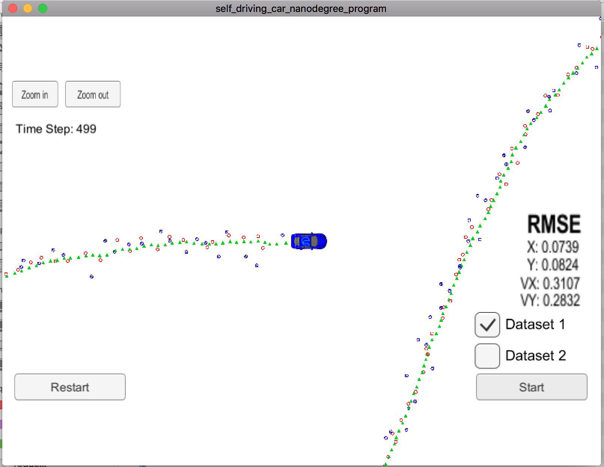
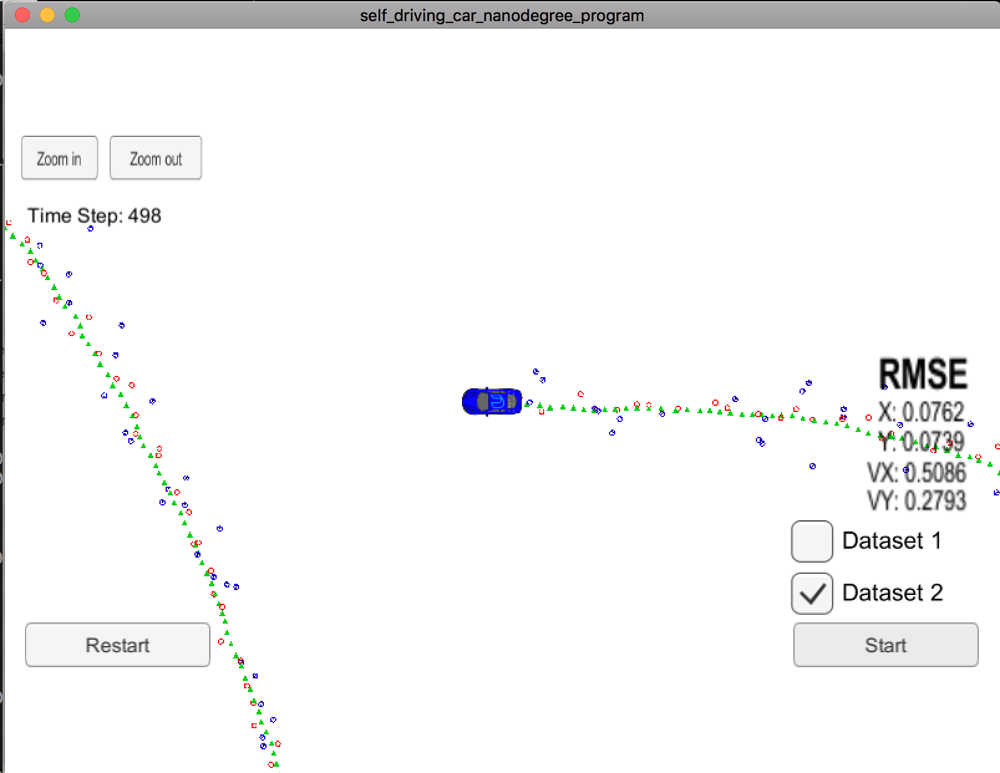

# Unscented Kalman Filter Project Starter Code
Self-Driving Car Engineer Nanodegree Program

In this project utilize an Unscented Kalman Filter to estimate the state of a moving object of interest with noisy lidar and radar measurements. Passing the project requires obtaining RMSE values that are lower that the tolerance outlined in the project rubric. 

This project involves the Term 2 Simulator which can be downloaded [here](https://github.com/udacity/self-driving-car-sim/releases)

This repository includes two files that can be used to set up and intall [uWebSocketIO](https://github.com/uWebSockets/uWebSockets) for either Linux or Mac systems. For windows you can use either Docker, VMware, or even [Windows 10 Bash on Ubuntu](https://www.howtogeek.com/249966/how-to-install-and-use-the-linux-bash-shell-on-windows-10/) to install uWebSocketIO. Please see [this concept in the classroom](https://classroom.udacity.com/nanodegrees/nd013/parts/40f38239-66b6-46ec-ae68-03afd8a601c8/modules/0949fca6-b379-42af-a919-ee50aa304e6a/lessons/f758c44c-5e40-4e01-93b5-1a82aa4e044f/concepts/16cf4a78-4fc7-49e1-8621-3450ca938b77) for the required version and installation scripts.

Once the install for uWebSocketIO is complete, the main program can be built and ran by doing the following from the project top directory.

1. mkdir build
2. cd build
3. cmake ..
4. make
5. ./UnscentedKF

Tips for setting up your environment can be found [here](https://classroom.udacity.com/nanodegrees/nd013/parts/40f38239-66b6-46ec-ae68-03afd8a601c8/modules/0949fca6-b379-42af-a919-ee50aa304e6a/lessons/f758c44c-5e40-4e01-93b5-1a82aa4e044f/concepts/23d376c7-0195-4276-bdf0-e02f1f3c665d)

---

## Other Important Dependencies
* cmake >= 3.5
  * All OSes: [click here for installation instructions](https://cmake.org/install/)
* make >= 4.1 (Linux, Mac), 3.81 (Windows)
  * Linux: make is installed by default on most Linux distros
  * Mac: [install Xcode command line tools to get make](https://developer.apple.com/xcode/features/)
  * Windows: [Click here for installation instructions](http://gnuwin32.sourceforge.net/packages/make.htm)
* gcc/g++ >= 5.4
  * Linux: gcc / g++ is installed by default on most Linux distros
  * Mac: same deal as make - [install Xcode command line tools](https://developer.apple.com/xcode/features/)
  * Windows: recommend using [MinGW](http://www.mingw.org/)

## Basic Build Instructions

1. Clone this repo.
2. Make a build directory: `mkdir build && cd build`
3. Compile: `cmake .. && make`
4. Run it: `./UnscentedKF` Previous versions use i/o from text files.  The current state uses i/o
from the simulator.

# [Rubric](https://review.udacity.com/#!/rubrics/783/view)

## Your code should compile.
Code must compile without errors with cmake and make, I did not change `CMakeLists.txt` and the code compiles as expected, after installing the requirements.

```
-- Configuring done
-- Generating done
-- Build files have been written to: /Users/feleir/Desktop/SelfDriving/CarND-Unscented-Kalman-Filter-Project/build
[ 25%] Building CXX object CMakeFiles/UnscentedKF.dir/src/ukf.cpp.o
[ 50%] Building CXX object CMakeFiles/UnscentedKF.dir/src/main.cpp.o
[ 75%] Building CXX object CMakeFiles/UnscentedKF.dir/src/tools.cpp.o
[100%] Linking CXX executable UnscentedKF
ld: warning: directory not found for option '-L/usr/local/Cellar/libuv/1*/lib'
[100%] Built target UnscentedKF
```

## px, py, vx, vy output coordinates must have an RMSE <= [.09, .10, .40, .30] when using the file: "obj_pose-laser-radar-synthetic-input.txt", which is the same data file the simulator uses for Dataset 1.

For the dataset 1 the obtained accuracy is.

RMSE = [0.0739, 0.0824, 0.3107, 0.2832] <= [.09, .10, .40, .30]


For EKF the result was [0.0974, 0.0855, 0.4517, 0.4404] so there was a great improvement.

For the dataset 2 the obtained accuracy is, with Vx greater than the expected 0.40

RMSE = [0.0762, 0.0739, 0.5086, 0.2793] <= [.09, .10, .40, .30]


For EKF the result was  [0.0726, 0.0965, 0.4216, 0.4932] so there was improvement in all values but Vx.

## Your Sensor Fusion algorithm follows the general processing flow as taught in the preceding lessons.

While you may be creative with your implementation, there is a well-defined set of steps that must take place in order to successfully build a Kalman Filter. As such, your project should follow the algorithm as described in the preceding lesson.

UKF implementation can be found in [src/ukf.cpp](./src/ukf.cpp), following the algorithm taught in the lessons.

## Your Kalman Filter algorithm handles the first measurements appropriately.

Your algorithm should use the first measurements to initialize the state vectors and covariance matrices.

Value initialization can be found in [src/ukf.cpp](./src/ukf.cpp#L15-L75), and matrix initialization takes into account the sensor type and initialez state and covariance matrixes in [src/ukf.cpp](./src/ukf.cpp#L93-L125).

## Your Kalman Filter algorithm first predicts then updates.

Upon receiving a measurement after the first, the algorithm should predict object position to the current timestep and then update the prediction using the new measurement.

Timestamp update can be found in [src/ukf.cpp](./src/ukf.cpp#L129-L131), then calling *Prediction* and finally Update based on the sensor type.

## Your Kalman Filter can handle radar and lidar measurements.

Your algorithm sets up the appropriate matrices given the type of measurement and calls the correct measurement function for a given sensor type.

*UpdateLidar* function sets the appropiate values for Lidar measurements, found in [src/ukf.cpp](.src/ukf.cpp#L260), so does the function *UpdateRadar* in [src/ukf.cpp](./src/ukf.cpp#L339)
